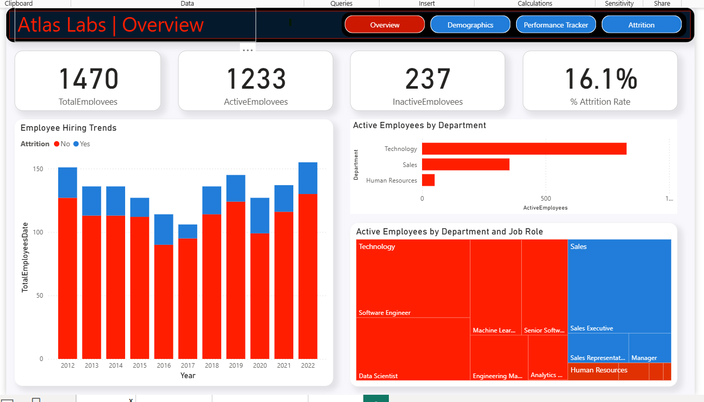
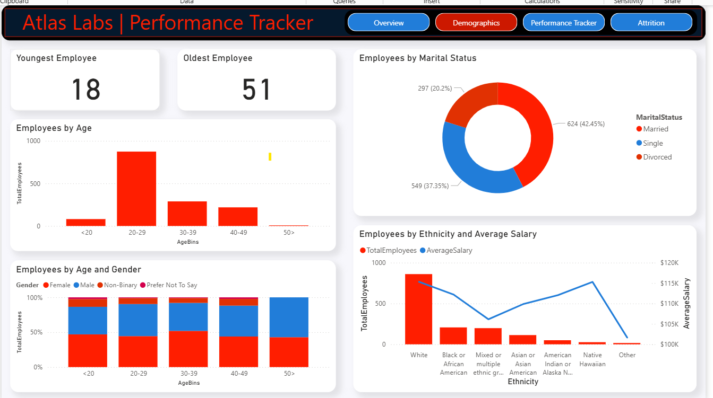
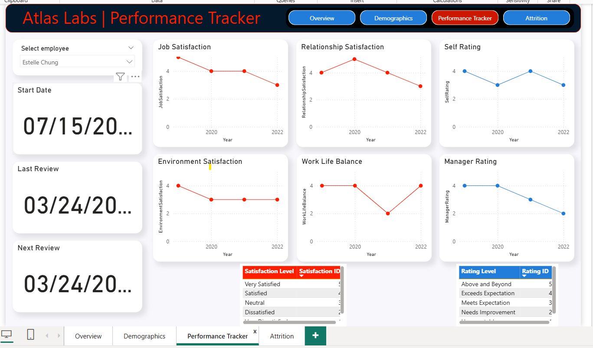
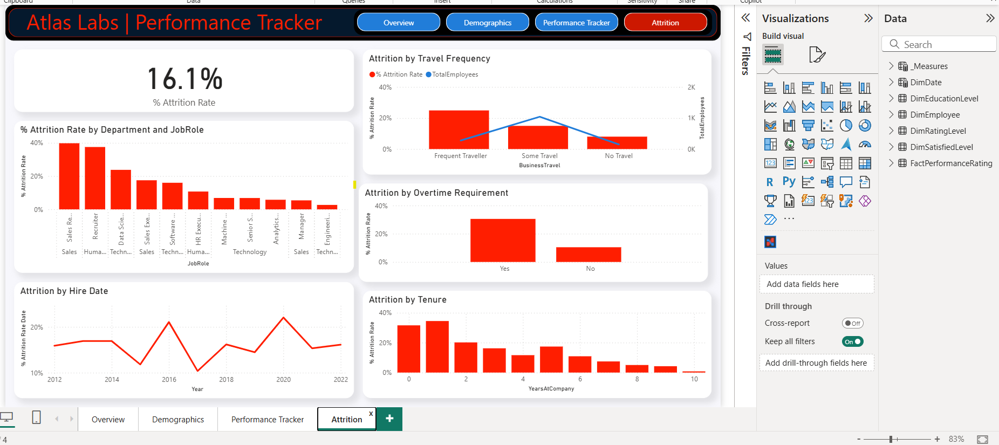

# 👩‍💼 HR Analytics & Employee Attrition Dashboard – Power BI Project  

## 📌 Project Overview  
This project focuses on analyzing **employee performance, satisfaction, and attrition** data to help organizations improve **retention strategies** and **employee engagement**.  

The dashboard answers key HR questions such as:  
- What is the overall attrition rate in the company?  
- Which departments and job roles have the highest turnover?  
- How do factors like tenure, overtime, and travel frequency affect attrition?  
- How satisfied are employees with their jobs, managers, and work-life balance?  

---

## 📂 Dataset  
The dataset is an **HR Employee dataset** that includes:  
- 👤 **Employee demographics** (age, gender, department, role, education)  
- 📊 **Performance & rating data** (manager ratings, self-ratings, job satisfaction)  
- ⏳ **Employment details** (hire date, tenure, attrition status)  
- 🌍 **Other factors** (travel frequency, overtime requirement, environment satisfaction)  

---

## 🔧 Data Preparation  
1. **Data Cleaning**  
   - Removed null values & duplicates  
   - Standardized categorical fields (e.g., job roles, departments)  

2. **Data Modeling**  
   - Built relationships between **FactPerformanceRating** and multiple **Dim tables** (Employee, Date, Education, etc.)  
   - Created measures for:  
     - Attrition Rate (%)  
     - Active vs Inactive Employees  
     - Employee Satisfaction Metrics  

---

## 📊 Dashboard Pages  

### 1️⃣ Overview  
- Total Employees, Active vs Inactive Employees  
- % Attrition Rate (overall)  
- Hiring trends by year  
- Active employees by department & job role  

  

---

### 2️⃣ Demographics  
- Breakdown of employees by gender, age, and education level  
- Department distribution  
- Workforce diversity insights
  
---

### 3️⃣ Performance Tracker  
- Individual employee performance tracking  
- Job Satisfaction, Relationship Satisfaction, Self Rating, Manager Rating  
- Environment Satisfaction & Work-Life Balance trends  
- Employee review timelines (start, last, next review)  

  

---

### 4️⃣ Attrition Analysis  
- % Attrition by Department & Job Role  
- Attrition by Travel Frequency  
- Attrition by Overtime Requirement  
- Attrition by Tenure & Hire Date  

  

---

## 🎯 Key Insights  
- Overall company attrition rate is **16.1%**.  
- **Sales Representatives & Recruiters** have the highest turnover rates (>35%).  
- Employees with **frequent travel** and **mandatory overtime** are more likely to leave.  
- Attrition is highest among employees with **1–3 years of tenure**, suggesting early disengagement.  
- Declining satisfaction trends (manager rating, environment satisfaction) indicate risk factors for retention.  

---

## 🛠️ Tools & Skills Demonstrated  
- **Power BI** (data modeling, DAX measures, interactive dashboards)  
- **Data Cleaning & Transformation**  
- **HR Analytics** – employee retention, engagement, and workforce planning  
- **Business Insights & Storytelling with Data**  

---

## 🚀 How to Use  
- Clone this repository  
- Open the `.pbix` file in Power BI Desktop  
- Explore the interactive dashboards  

---

## 📌 About Me  
I’m a **Data Analyst** skilled in SQL, Power BI, Python, and data visualization.  
This project demonstrates how I can turn HR data into actionable insights that help organizations improve **employee engagement and retention**.  

## 📬 Contact  
- Email: yasserhassen98@gmail.com
- LinkedIn: [linkedin.com/in/yourprofile](www.linkedin.com/in/hassan-yasser-2000hh)  
- GitHub: [github.com/yourusername](https://github.com/sonh2000)  
